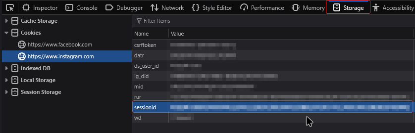

### Instagram DM Scraper

## Description
This little script scrapes every private message with any user. You can either just read it in the console or export the chats to a text file to have it saved

## Dependency

This fork of the project uses uv as the package manager.
You can install uv with:

```pwsh
pip install uv
```


## How to start
- You need to have Python 3.x installed in your system
- Download the source code (Either from releases or master branch)
- Install the requirements via uv, just type in the console `uv init` then followed by `uv sync`
- Next, you need the sessionid of the account you're trying to scrape from.

    - You can get the sessionid via your Browser. This demonstration shows how to find it on **Firefox**:
      
      You have to open the developer tools (**F12**) and then navigate to Storage, there on the left sidebar open the **Cookies** tab, then open the URL for Instagram and the **sessionid** will be displayed in to the right.
- Once you have all that, just following the script's steps, which should get you where you want to be.

## Features
- See all DMs the user has
- Fetch all messages from any DM chat
- Fetch only messages more recent that specified date (optional)
- Export fetched messages to text file
- Stream the chat live. See the messages coming in in real time

## What's the sessionid?
The sessionid is a cookie that the Instagram website stores in your browser when there's an account logged in it.
If you need to find out the sessionid take a look at [CookiesGrabber](https://github.com/xlysander12/CookiesGrabber)
